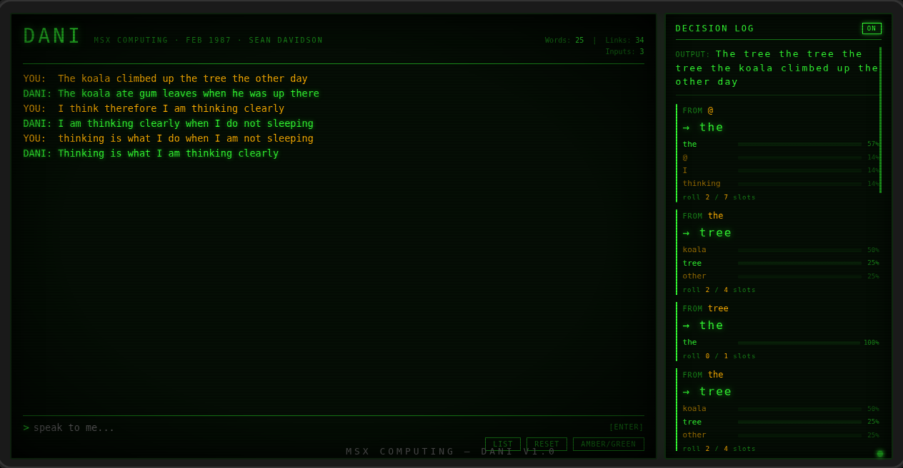

# DANI — Dynamic Artificial Non-Intelligence

> *"The next best thing to artificial intelligence."*
> — MSX Computing, February 1987

A faithful JavaScript port of **DANI**, an MSX BASIC conversational AI program by **Sean Davidson**, originally published in *MSX Computing* magazine, February 1987.

**[▶ Try it live](https://your-username.github.io/dani)** &nbsp;|&nbsp; [Read the original article](docs/)

---



---

## What is DANI?

DANI (**D**ynamic **A**rtificial **N**on-**I**ntelligence) is a self-learning word-association chatbot that fits in under 2KB of code. Unlike ELIZA — which pattern-matched against pre-programmed keyword lists — DANI builds a genuine probabilistic word-link graph at runtime from whatever you type to it, then generates replies by traversing that graph.

It starts knowing absolutely nothing. The more you talk to it, the more it learns. Its replies are drawn entirely from your own words, recombined in ways that can be uncanny, poetic, or absurd.

It was written in 1987 for an 8-bit home computer with 64KB of RAM. It still works.

---

## How it works

```
INPUT:   "The koala climbed up the tree the other day"
INPUT:   "The koala ate gum leaves when he was up there"

OUTPUT:  "The koala ate gum leaves when he was up the tree the other day"
OUTPUT:  "The koala climbed up there"
```

Every sentence you type is tokenised into words. For each consecutive word pair (**W1 → W2**), DANI records:

- That W2 can follow W1
- How many times it has seen that link

To generate a reply, it starts from a word and randomly walks the graph — selecting successors weighted by how frequently each link appeared in your input. More-repeated phrases carry more weight.

The special token `@` marks sentence boundaries, so the model naturally learns which words start and end sentences.

### The data structure (1987 memory-saving trick)

On an MSX with 64KB RAM, storing a full matrix of word relationships would exhaust memory almost instantly. Sean Davidson's solution: encode word indices as **2-byte ASCII strings** and concatenate them into a single BASIC string variable.

Each word `X` has:
- `FO$(X,0)` — a packed string of 2-byte path entries (each encoding a word index that has followed X)
- `FO$(X,1)` — a parallel string of 1-byte frequency counters

The encoding maps index → two printable characters (value + 32, to stay above the control-character range). This lets the entire word graph live in BASIC string space at O(links) memory rather than O(words²).

The JavaScript port preserves this exact scheme.

---

## Running it

**No build step. No dependencies. No server.**

```bash
git clone https://github.com/your-username/dani.git
cd dani
open index.html        # macOS
# or: xdg-open index.html  (Linux)
# or: just double-click index.html in your file manager
```

Or visit the **[live demo](https://your-username.github.io/dani)**.

---

## Usage

| Action | What to do |
|--------|-----------|
| Talk to DANI | Type anything and press **Enter** |
| See what it has learned | Type **`list`** |
| Start fresh | Type **`reset`** or click the RESET button |
| Switch phosphor colour | Click **AMBER/GREEN** |

**Tips for better results:**
- Use complete sentences — DANI learns from sentence structure, not just vocabulary
- Repeat key phrases — links gain weight with repetition, making those paths more likely in output
- The more you input, the more varied and interesting the replies become

---

## Repository structure

```
dani/
├── index.html              ← The entire app (single file, self-contained)
├── archive/
│   └── DANI_original.bas   ← Original MSX BASIC source, extracted from magazine
├── docs/
│   ├── magazine_p1.jpg     ← Scanned magazine pages (MSX Computing, Feb 1987)
│   ├── magazine_p2.jpg
│   ├── magazine_p3.jpg
│   └── magazine_p4.jpg
├── .github/
│   └── ISSUE_TEMPLATE/
├── CHANGELOG.md
├── CONTRIBUTING.md
└── LICENSE
```

---

## Original BASIC source

The original MSX BASIC program is preserved verbatim in [`archive/DANI_original.bas`](archive/DANI_original.bas). Scans of the original magazine pages are in [`docs/`](docs/).

Key line number reference:

| Lines | Section |
|-------|---------|
| 5–140 | Title & introduction screen |
| 180–240 | Initialisation |
| 300–390 | Input text line |
| 500–630 | Tokeniser — analyse text, find words |
| 700–830 | Learning — put words in linked array |
| 900–1030 | `list` command — print results table |
| 1060–1100 | SUB: decode numerical string |
| 1160–1220 | SUB: choose word path (weighted random) |
| 1300–1400 | Reply generation |

---

## Variable reference

| Variable | Description |
|----------|-------------|
| `WD$(X)` | Word dictionary — each slot holds one word token |
| `FO$(X,0)` | Paths string — packed 2-byte indices of words that follow word X |
| `FO$(X,1)` | Frequency string — parallel byte counters for each path |
| `MW` | Current dictionary size (max word index) |
| `LW` | Last word index — source node for the current link being recorded |
| `PN` | Pass number — input line count |
| `AT$` | `"@ "` prefix added from the 2nd input onwards |
| `PC$` | Allowed punctuation characters: `@.!?` |
| `LG$` | Legal word characters: hyphens, apostrophes, a–z, A–Z |
| `LC` | Split point in `LG$` between lowercase and uppercase (= 28) |

---

## JS port — fidelity notes

The JavaScript port in `index.html` aims for **algorithmic fidelity** to the BASIC original, not just behavioural equivalence.

| BASIC construct | JS equivalent |
|----------------|---------------|
| `HI=WD/220:LO=WD-HI*220` then `CHR$(LO+32)+CHR$(HI+32)` | `encodeIndex(wd)` |
| `GOSUB 1100` — `VL=ASC(VL$)-32+220*(ASC(RIGHT$(VL$,1))-32)` | `decodeIndex(s)` |
| `INSTR(FO$(LW,0), LH$)` — find link | `FO[LW][0].indexOf(lh)` |
| `MID$(FO$(LW,1), pos) = CHR$(byte+1)` — increment freq | String rebuild at byte offset |
| `CH$` weighted expansion + `MID$(CH$, RND*LEN)` | `chooseNext()` |
| `DEFINT A-Z` + `CLEAR 5000` | `Math.floor()` throughout; arrays pre-allocated |

One deliberate divergence: the original's word-selection at line 1210 only decodes the **low byte** of the 2-byte path entry (`ASC(MID$(PS$,WN*2-1)+" ")-32`), which silently limits word indices to 0–219. The JS port uses full 2-byte decoding, supporting all 500 dictionary slots correctly.

---

## Ideas for further development

From the original article, and beyond:

- **Question detection** — auto-append `?` when a reply starts with "Why", "Do", "Is", etc.
- **Save / load** — persist the word graph to `localStorage` or as a JSON file
- **N-gram context** — track the last 2 words instead of 1 for more coherent replies
- **Corpus pre-loading** — seed DANI from a text file before the user starts talking
- **Loop detection** — prevent the same link appearing twice in one output sentence
- **Syllable linking** — treat "do" and "doing" as related (the article suggested this)
- **ELIZA hybrid** — route keyword patterns to canned responses alongside the Markov output
- **Graph visualisation** — render the word-link graph as a force-directed diagram

---

## Credits

- **Original program**: Sean Davidson, *MSX Computing*, February 1987
- **JavaScript port**: based on the extracted BASIC source
- **Fonts**: [VT323](https://fonts.google.com/specimen/VT323) and [Share Tech Mono](https://fonts.google.com/specimen/Share+Tech+Mono) via Google Fonts

---

## License

The JavaScript port is released under the **MIT License** — see [LICENSE](LICENSE).

The original BASIC program and magazine scans are reproduced for **educational and preservation purposes**. Original copyright belongs to Sean Davidson and MSX Computing magazine (1987).
